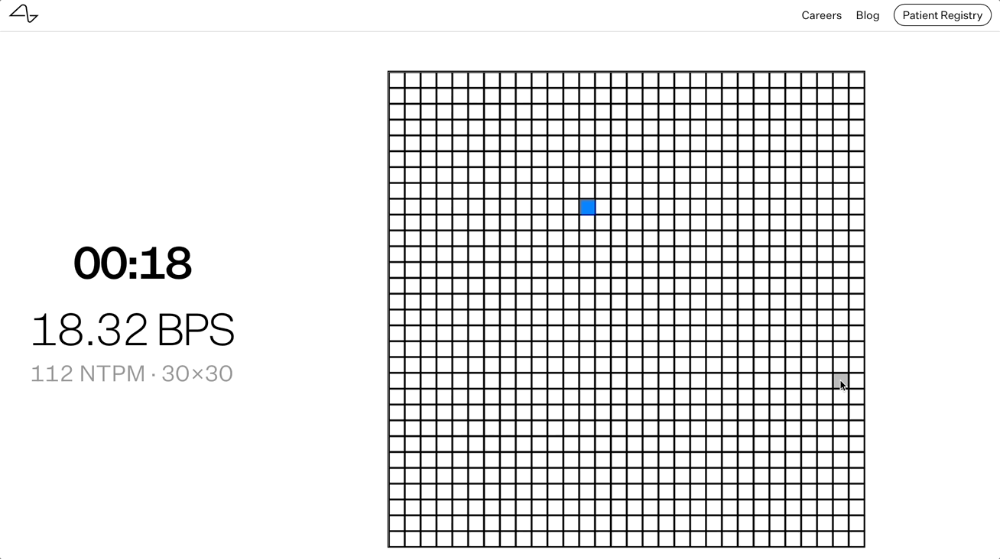

# pyautogui-webgrid
Automating mouse movements to play webgrid and visualize what optimal BPS performance looks like.

## Run the code locally
1. Clone the repository
2. Read the instructions in "start.sh"
3. Run '. ./start.sh'

## Resources
[pyautogui](https://pyautogui.readthedocs.io/en/latest/mouse.html)

[webgrid](https://neuralink.com/webgrid/)

[Medium Article: Playing Webgrid & Speculating on How to Improve Performance](https://medium.com/@e.woods.business/playing-webgrid-speculating-on-how-to-improve-performance-7d40d094819b)
