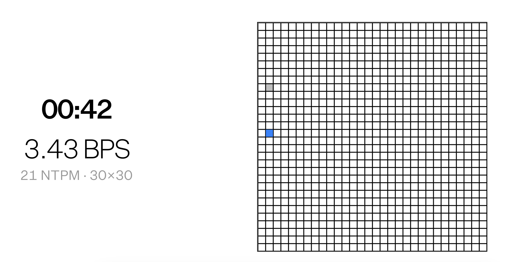

# pyautogui-webgrid
Automating mouse movements to play webgrid and visualize what optimal BPS performance looks like.

## Resources
[pyautogui](https://pyautogui.readthedocs.io/en/latest/mouse.html)
[webgrid](https://neuralink.com/webgrid/)